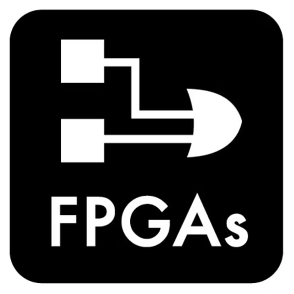

  

<table><th><h2 align="center">ABOUTME.txt</h2></th>
<tr><td>
  <h4>Hey , I'm Magdy Ahmed. I'm passionate about Digital Electronics Design and Verification🤖! I'm currently doing my bachelor degree📠in Electronics and Electrical Communications Engineering at Faculty of Engineering, Cairo UniversityğŸ«.</h4>

> 🌱 I’m currently learning **Digital Design and Digital Verification**

> 👥 I’m looking to collaborate on **more Digital Design and Verification Projects** 🔭

> 📫 How to reach me magdy4216690@gmail.com or Magdy.Al-Abraq02@eng-st.cu.edu.eg

<h3 align="left">🌠Connect with me:</h3>

<code></code>
<code></code>

<h3 align="left">💻 Languages:</h3>
‍
<code></code>
<code></code>
<code></code>
<code></code>
<code></code> 
<code></code>

<h3 align="left">🔨 Tools / Frameworks / Others:

<code></code>
<code></code>
<code></code>
<code></code>
<code></code>
  

  

&nbsp;

  </td>
  </tr>
  <tr>
    <td>
      
      <h4 align="right">View Count</h4>
     
    </td>
  </tr>
  <table>     

